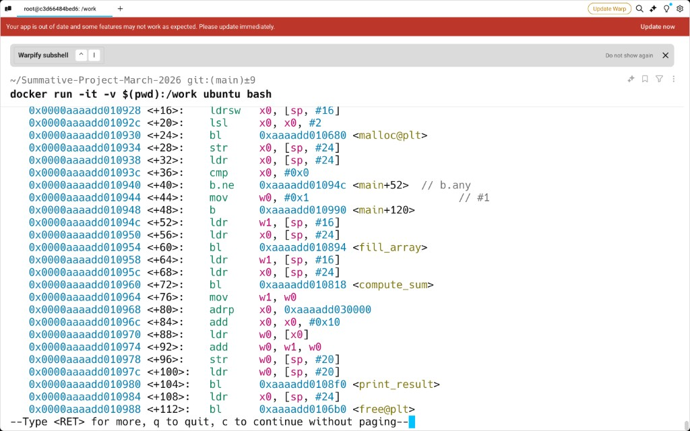
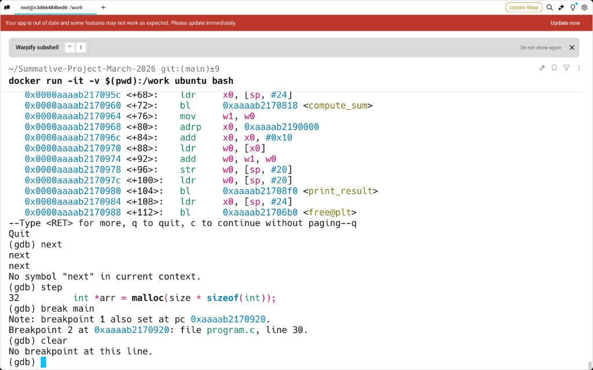
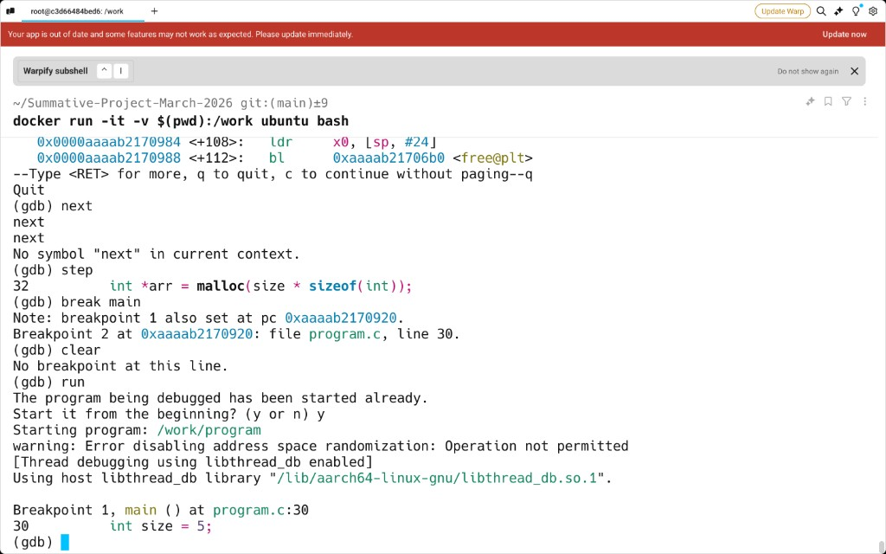
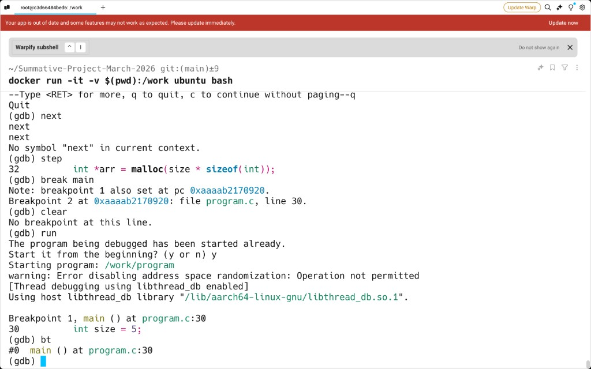
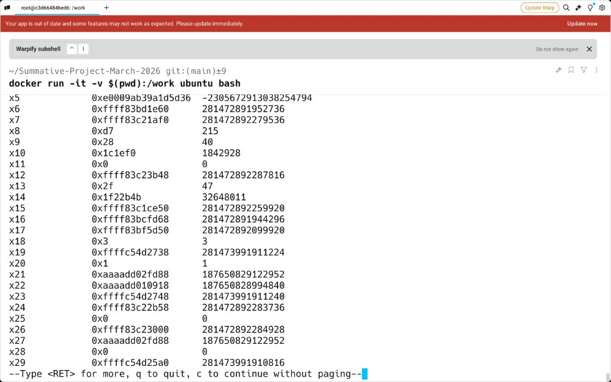

# Question 1 — Reverse Engineering Your Own ELF Binary  
## Structured Analysis Report (template)

For **Google Docs**: paste the Markdown body without expecting images to transfer; instead insert the PNGs from **`report_assets/`** using **`QUESTION1_FIGURES_FOR_GOOGLE_DOCS.txt`** (ordered list + captions).

---

**Student:** [Your name / ID]  
**Source:** `program.c`  
**Binary analyzed:** `program` (stripped ELF, built per brief)  

> **MacBook note:** `gcc` on macOS produces **Mach-O**, not ELF. Build and run the tools below on **Linux** (lab PC, VM, WSL, or Docker) so `readelf`, `objdump`, `strace`, and `gdb` match the assignment’s ELF format. Example build inside Linux:
>
> ```bash
> gcc -Wall -O0 -fno-inline -o program program.c
> strip program
> ```

---

## 1. Program construction (brief compliance)

| Requirement | How this program satisfies it |
|-------------|--------------------------------|
| Exactly **three** user-defined functions (excluding `main`) | `compute_sum`, `fill_array`, `print_result` |
| At least one **loop** | Loops in `compute_sum` and `fill_array` (`for` over `size`) |
| At least one **conditional branch** | `if (arr[i] > 0)` in `compute_sum`; `if (!arr)` in `main` |
| **Dynamic allocation** | `malloc(size * sizeof(int))` |
| **Write** to allocated memory | `fill_array` writes `arr[i] = i - 2` |
| **Standard library** | `malloc`, `free`, `printf` |
| **Global variable** | `int global_counter = 5` (initialized) |
| **Stdout output** | `printf("Result: %d\n", result)` via `print_result` |
| **Build flags** | `gcc -Wall -O0 -fno-inline -o program program.c` then `strip program` |

**High-level behaviour:** `main` allocates an array of 5 ints, fills it with `fill_array` (values −2..2), computes the sum of **positive** elements in `compute_sum`, adds `global_counter`, prints with `print_result`, then `free`s the buffer.

---

## 2. Part A — Static ELF structure (`readelf`)

Run (on the **ELF** `program`):

```bash
readelf -h program          # ELF header
readelf -l program          # Program headers / segments
readelf -S program          # Section headers
readelf -d program          # Dynamic section (if dynamically linked)
```

### 2.1 Architecture

- **From `readelf -h`:** Machine / class — *paste one line:*  
  `[e.g. Advanced Micro Devices X86-64 / ELF64]`

### 2.2 Entry point

- **From `readelf -h`:** `Entry point address:` — *paste:* `0x________`

This is typically **`_start`**, not `main`. The C runtime (`__libc_start_main` or equivalent) eventually calls `main` after process setup.

### 2.3 Dynamic linking

- **From `readelf -d`:** If you see `NEEDED` entries (e.g. `libc.so.6`), the binary is **dynamically linked**. If the dynamic section is empty or absent, it may be **statically** linked — *state which applies and paste relevant lines.*

### 2.4 Execution-related sections (what to say)

| Section | Role (one sentence each) |
|---------|---------------------------|
| **`.text`** | Executable machine code (functions including `main`, library code if linked in). |
| **`.data`** | Initialized read/write globals (e.g. **`global_counter = 5`**). |
| **`.bss`** | Uninitialized or zero-initialized writable globals (none in this minimal program if all globals are in `.data`). |
| **`.plt`** | Procedure Linkage Table — small stubs that jump through the GOT to resolve external calls the first time (lazy binding). |
| **`.got` / `.got.plt`** | Global Offset Table — holds addresses of external symbols (e.g. `malloc`, `printf`, `free`) filled by the dynamic linker. |

*Optional (excellence):* mention **RELRO** (`readelf -l`): **Partial RELRO** is common — GOT read-only after relocation; **Full RELRO** makes GOT fully read-only at load time.

---

## 3. Part B — Disassembly (`objdump`)

```bash
objdump -d -M intel program    # or -M att for AT&T syntax
objdump -t program             # symbols — use **before** strip for names; stripped → no names
```

### 3.1 Identifying `main`

After stripping, symbols are gone. Identification strategies:

1. **`readelf -h`** entry point → start of `_start` in `objdump -d`.
2. **`__libc_start_main`** (dynamic) receives the address of **`main`** as an argument (System V AMD64 ABI: often in **`RDI`** when the libc glue runs). Tracing from `_start` helps locate the call to `main`.
3. **`main`** often has a distinct prologue and calls **three** functions matching your control flow: `fill_array` → `compute_sum` → `print_result`, plus PLT calls to `malloc` / `printf` / `free`.

*Record the hex address you believe is `main`:* `0x________`

### 3.2 The three user-defined functions

| Your C function   | Role | Evidence in disassembly (fill after you inspect) |
|-------------------|------|-----------------------------------------------------|
| `fill_array`      | Loop writes `arr[i]` | Loop over index; stores to memory via pointer |
| `compute_sum`     | Loop + `if (arr[i] > 0)` | Conditional jump (`jg` / `jle` / etc.) inside a loop |
| `print_result`    | Calls `printf` | PLT call to `printf@plt` with format string address |

*Paste short snippets or addresses for each.*

### 3.3 One conditional jump (C ↔ assembly)

**Example (conceptual):** In `compute_sum`, the test `arr[i] > 0` becomes a **compare** (`cmp`) and a **conditional jump** (e.g. `jle` “jump if ≤0”) that **skips** the `sum += arr[i]` block.

- **Assembly condition:** *e.g.* `cmp` sets flags; `jXX` tests **sign / zero**.  
- **C logic:** if the condition fails, control skips the addition; if it passes, `sum` is updated.

*Paste one real instruction pair from your dump:* `____________` → maps to **`if (arr[i] > 0)`**.

### 3.4 One loop-related jump

**Example:** At the end of the loop body, an **unconditional jump** (`jmp`) or **backward** conditional goes to the **loop head** where the index is compared to `size`.

- **Assembly:** *e.g.* `jmp` to `.L_loop` or `cmp` + `jl` for `i < size`.  
- **C:** `for (i = 0; i < size; i++)`.

*Paste one jump and label / target address.*

### 3.5 Control flow between functions

Describe the **call order**:

1. `main` → `malloc` (PLT)  
2. `main` → `fill_array`  
3. `main` → `compute_sum`  
4. `main` → uses **`global_counter`** (load from `.data`)  
5. `main` → `print_result` → `printf` (PLT)  
6. `main` → `free` (PLT)

*Each `call` pushes a return address; `ret` pops and jumps back.*

---

## 4. Part C — Runtime behaviour (`strace`)

```bash
strace ./program
```

### 4.1 Unique system calls observed

*List unique syscalls (one line each):*  
`[ e.g. execve, brk, mmap, mmap, openat, read, write, arch_prctl, set_tid_address, exit_group ... ]`

### 4.2 Categorization

| Category | Syscalls (examples from your run) |
|----------|-------------------------------------|
| **Memory management** | `brk`, `mmap`, `munmap` (heap arena / mappings) |
| **Terminal I/O** | `write` (fd 1 = stdout) |
| **Startup / termination** | `execve`, `exit_group` / `exit` |
| **Dynamic linking** | `openat`/`read`/`mmap` on loader or libc (often seen during startup) |

### 4.3 Short explanations

- **`malloc` at syscall level:** `malloc` is **libc**, not a single syscall. It manages a heap; first use often triggers **`brk`** (move program break) and/or **`mmap`** for anonymous mappings. You may see **`brk(NULL)`** to query the break, then **`brk(addr)`** to extend, or **`mmap`** for larger chunks.

- **`printf` → syscalls:** `printf` buffers stdout; when the buffer flushes, you see **`write(1, "...Result: ...", n)`**.

- **Heap growth:** Note whether you see **`brk`** and/or **`mmap`** after startup — *paste one relevant line.*

---

## 5. Part D — Dynamic analysis (`gdb`)

Use the **unstripped** binary first (easier names), then repeat key ideas on **stripped** if required.

```bash
gdb -q ./program
```

### 5.1 Breakpoints

```gdb
break _start          # if symbol exists; else break *<entry from readelf -h>
break main
break compute_sum     # if not stripped; else break *<address from objdump>
run
```

### 5.2 Stack frames (`bt`)

When stopped inside a function:

```gdb
bt
info frame
info registers
```

*Describe:* frame for `main` vs frame for `compute_sum` — saved **RBP**, return address on stack.

### 5.3 Registers at a conditional branch

Stop at the **`cmp` / `j`** pair for `arr[i] > 0`. *Record:* **`RDI, RSI, RDX`** (first args per AMD64 ABI: often `arr` in `RDI`, `size` in `RSI` for `compute_sum` — confirm in your dump).

### 5.4 Memory inspection

| Location | GDB command idea | What you should see |
|----------|------------------|---------------------|
| **Stack** | `x/16gx $rsp` near `main` | Local `size`, saved registers, etc. |
| **Heap** | After `malloc`, `print` pointer; `x/8wx <ptr>` | Five `int`s: `-2, -1, 0, 1, 2` (little-endian) |
| **Global** | `x/wd &global_counter` or `print &global_counter` | Value **5** |

### 5.5 Where things live

- **Global `global_counter`:** Section **`.data`** (initialized non-zero).  
- **Heap array `arr`:** Address returned by **`malloc`** — in the **heap** range (often from `brk`/`mmap` arena).  
- **Locals (`size`, `result`, loop `i`):** **Stack** — in `main`’s (or each function’s) stack frame.

---

## 6. Part E — Integrated summary

### 6.1 Textual control-flow model

```
_start → [C runtime init] → main:
  malloc → fill_array → compute_sum → load global_counter → add → print_result → free → return 0
```

### 6.2 Function interaction sequence

`main` orchestrates; **`fill_array`** only writes memory; **`compute_sum`** reads and reduces to an `int`; **`print_result`** is the only direct `printf` path for the final line.

### 6.3 Memory classification

| Kind | Examples in this program |
|------|---------------------------|
| **Stack** | `main` locals (`size`, `result`, …), saved frame pointers, return addresses |
| **Heap** | Array allocated by `malloc` |
| **Global (.data)** | `global_counter` |
| **`.bss`** | (If any zero/uninit globals — optional in your build) |

### 6.4 Transition `_start` → `main`

Briefly: **dynamic linker** loads libc; **`_start`** sets up stack and registers; **`__libc_start_main`** receives `main`’s address and calls it; on return, exit path runs (e.g. `exit`).

### 6.5 PLT / GOT usage

External functions (**`malloc`**, **`printf`**, **`free`**) are called via **`.plt`** stubs. The **`.got.plt`** holds the resolved addresses after the first call (lazy binding) or at load (with RELRO). *Mention one line from `objdump -d` showing `call malloc@plt`.*

---

## 7. Extra analytical depth (aim for “Excellent”)

- **System V AMD64 ABI:** First integer/pointer args in **`RDI`, `RSI`, `RDX`, `RCX`, `R8`, `R9`**; return value in **`RAX`**. (On **AArch64** Linux — e.g. Docker on Apple Silicon — use **`x0`–`x7`** for args and **`x0`** for return; **`bl`** replaces **`call`**.)  
- **Stack alignment:** Before a `call`, **`RSP ≡ 0 (mod 16)`** after `call` (8-byte return address).  
- **Stripping:** `strip` removes symbol table / debug info — names disappear in `objdump` but **`.text`** code is unchanged.  
- **Security (optional):** `checksec` or `readelf`: **PIE**, **NX** (stack non-executable), **RELRO**, **Canary** if enabled by default on your distro.

---

## 8. Screenshots / appendix

### Environment note (these captures)

The following screenshots were taken inside **Docker** (`ubuntu` image) on a **MacBook**, so the disassembly is **64-bit ARM (AArch64)** Linux ELF: instructions use **`bl`** (branch-with-link) instead of x86 **`call`**, registers **`x0`–`x8`** instead of **`RDI`/`RSI`/…**, and **`x29`** as the frame pointer. That still satisfies the report’s goals (identify **`main`**, user functions, **PLT** calls to **`malloc`/`printf`/`free`**, stack/debugger use). If your rubric requires **x86-64** wording explicitly, either add a sentence that your analysis machine is **aarch64** or repeat the same steps on an **amd64** Linux container:  
`docker run --rm -it --platform linux/amd64 -v "$PWD":/work -w /work ubuntu:22.04 bash`

### Checklist (also capture if not shown below)

- [ ] `readelf -h` (architecture + entry)  
- [ ] `readelf -S` or `-l` (key sections)  
- [ ] `strace` excerpt: `write`, `brk`/`mmap`  
- [ ] `gdb`: `x` on heap, global, stack (optional extra)  

### Figure 1 — Disassembly of `main` (GDB): `malloc`, user functions, `free@plt`

Shows **`malloc@plt`**, null check, **`fill_array`**, **`compute_sum`**, **`print_result`**, and **`free@plt`** in **`main`**.



### Figure 2 — Calls to `compute_sum` / `print_result` and stepping to `malloc`

Shows **`bl`** calls to **`compute_sum`** and **`print_result`**, stepping to source line **`malloc`**, and breakpoint on **`main`**.



### Figure 3 — Breakpoint in `main`, `run`, and source at line 30

Program stops in **`main`** at **`int size = 5;`**; illustrates GDB source correlation. (ASLR-disable warning in Docker is common and harmless for this lab.)



### Figure 4 — Backtrace (`bt`) at `main`

Single frame **`#0  main () at program.c:30`** — stack inspection at entry to **`main`**.



### Figure 5 — Register state (`info registers`)

Sample **AArch64** register dump (**`x5`–`x29`**, **`x29`** frame pointer).



---

## 9. Commands cheat sheet (copy-paste on Linux)

```bash
gcc -Wall -O0 -fno-inline -o program program.c
./program
strip -o program.stripped program

readelf -h program.stripped
readelf -S program.stripped
readelf -d program.stripped
objdump -d -M intel program.stripped | less
strace -o strace.log ./program.stripped
gdb -q ./program
```


